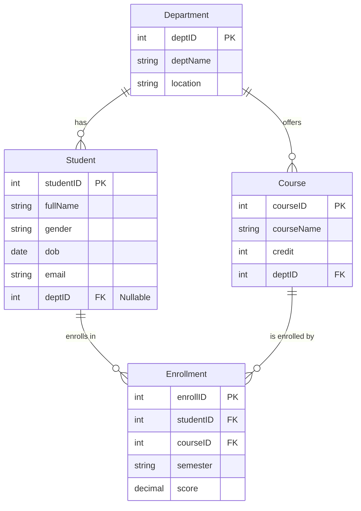

# 📊 Schema Explanation (ERD & Relationships)

This document visualizes the database schema used in `script.sql` and the mock exams.

## 🔹 Entity Relationship Diagram (ERD)

The following diagram shows the tables and their relationships.

## 🔹 Relationship Details

### 1. Department — Student (1:N)
- **Relationship:** One Department has many Students.
- **Constraint:** `Student.deptID` is a Foreign Key referring to `Department.deptID`.
- **Note:** A student *can* exist without a department (NULL), as seen with student `Do Van Q` in the sample data.

### 2. Department — Course (1:N)
- **Relationship:** One Department offers many Courses.
- **Constraint:** `Course.deptID` is a Foreign Key referring to `Department.deptID`.
- **Example:** The "Computer Science" department offers "Database Systems" and "Operating Systems".

### 3. Student — Course (M:N)
- **Relationship:** Many Students take Many Courses.
- **Implementation:** This is a Many-to-Many relationship, so it is broken down into two 1:N relationships using an intermediate table called **Enrollment**.
- **Enrollment Table:**
  - Connects `Student` and `Course`.
  - Stores extra attributes like `score` and `semester`.

### 4. Constraints & Edge Cases
- **Primary Keys (PK):** Uniquely identify each record (e.g., `studentID`).
- **Foreign Keys (FK):** Link tables together.
- **Edge Cases in Data:**
  - **Dept 6 (R&D):** Has no students.
  - **Student 117 (Do Van Q):** Has no department (NULL `deptID`).
  - **Student 116 (Le Thi P):** Has no enrollments.
  - **Course 211 (AI):** Has no enrollments.

